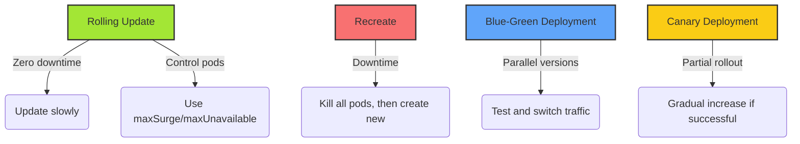

# Kubernetes Deployment Update Strategies

## 1. Rolling Update (default)

- Gradually creates new pods and deletes old ones.
    
- Tries to maintain minimum availability at all times.
    
- You can control the number of pods updated at once using `maxUnavailable` and `maxSurge`.
    

**Pros**:

- Zero-downtime.
    
- Fine-grained control over update speed.
    

**Cons**:

- Can be slower compared to other methods.
    

Example config:

```yaml
strategy:
  type: RollingUpdate
  rollingUpdate:
    maxSurge: 1
    maxUnavailable: 1
```

---

## 2. Recreate

- All old pods are terminated first.
    
- Only after they are gone, new pods are created.
    

**Pros**:

- Simple.
    
- No risk of incompatibility between old and new versions.
    

**Cons**:

- Causes downtime during deployment.
    

Example config:

```yaml
strategy:
  type: Recreate
```

---

## 3. Blue-Green Deployment (pattern)

- Deploy new version alongside the old one.
    
- Test the new version.
    
- Switch the traffic (via `Service` or other methods) to the new version once ready.
    

**Pros**:

- Instant rollback if needed.
    
- Easy pre-release testing.
    

**Cons**:

- Consumes more resources (double pods for a while).
    

_Note_: Not built into Kubernetes Deployments natively — needs manual management or tools like ArgoCD.

---

## 4. Canary Deployment (pattern)

- Release the new version to a small percentage of users or pods.
    
- Gradually increase rollout if everything looks good.
    

**Pros**:

- Detect problems early.
    
- Safer deployments.
    

**Cons**:

- Requires more complex traffic management (e.g., Istio, Argo Rollouts).
    

---

## Summary

|Strategy|Downtime|Complexity|Resource Usage|
|:--|:--|:--|:--|
|Rolling Update|No|Low|Normal|
|Recreate|Yes|Very Low|Normal|
|Blue-Green|No|Medium|High|
|Canary|No|High|Normal|

---

## Diagram



---

> **Tip**: For advanced strategies, look into tools like Argo Rollouts, Flagger, or service meshes like Istio!