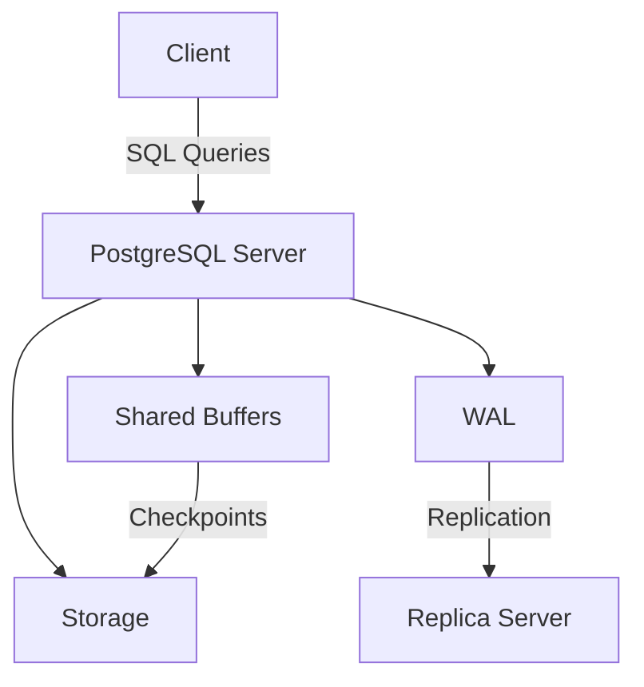

# PostgreSQL

**PostgreSQL** is an open-source, object-relational database management system (ORDBMS) known for its robustness, extensibility, and adherence to SQL standards. With over 35 years of active development, it is a preferred choice for handling complex workloads in industries like finance, healthcare, and e-commerce. This note provides a detailed overview tailored for a Senior DevOps Engineer preparing for interviews, focusing on key concepts, tools, and best practices.

## Overview

PostgreSQL, often called "Postgres," evolved from the POSTGRES project at UC Berkeley in 1986, led by Michael Stonebraker. It combines relational database principles with object-oriented features, supporting advanced data types, custom functions, and extensibility. Its key strengths include:

- **ACID Compliance**: Ensures reliable transactions with Atomicity, Consistency, Isolation, and Durability.
- **Extensibility**: Allows custom data types, functions, and extensions like [[PostGIS]] for geospatial data.
- **Scalability**: Manages terabytes of data and high concurrent user loads.
- **Cross-Platform**: Runs on Linux, Windows, macOS, and more.

PostgreSQL is widely used in [[CI/CD]] pipelines, [[Infrastructure as Code]] setups, and cloud-native environments, making it a critical topic for DevOps interviews. It also integrates with [[Kubernetes]] and [[Prometheus]] for efficient monitoring and operations.

## Key Features

### 1. Data Types and Extensibility
PostgreSQL supports a wide range of native data types, including:
- Standard SQL types: INTEGER, VARCHAR, TIMESTAMP, BOOLEAN
- Advanced types: JSON/JSONB, arrays, XML, and geospatial data (via [[PostGIS]])
- User-defined types: Create custom types with constraints (domains)

**Example: Creating a Custom Data Type**
```sql
CREATE TYPE user_status AS ENUM ('active', 'inactive', 'suspended');
CREATE TABLE users (
    id SERIAL PRIMARY KEY,
    status user_status NOT NULL
);
```
**Interview Tip**: Be prepared to discuss JSONB for semi-structured data and its indexing capabilities (e.g., GIN indexes) for performance optimization.

### 2. Transaction Management
PostgreSQL’s **Multi-Version Concurrency Control (MVCC)** ensures concurrent read/write operations without locks, except for same-row updates. It supports:
- **ACID Transactions**: Guarantees data integrity.
- **Write-Ahead Logging (WAL)**: Enables point-in-time recovery (PITR) and fault tolerance.

**Example: Transaction with Savepoints**
```sql
BEGIN;
INSERT INTO accounts (user_id, balance) VALUES (1, 1000);
SAVEPOINT my_savepoint;
UPDATE accounts SET balance = balance - 200 WHERE user_id = 1;
-- Error occurs
ROLLBACK TO my_savepoint;
COMMIT;
```
**Interview Question**: How does MVCC handle concurrent updates? *Answer*: MVCC creates a new version of a row for each update, allowing readers to access older versions while writers proceed, minimizing conflicts.

### 3. Indexing and Performance
PostgreSQL offers advanced indexing techniques:
- **B-tree**: Default for most queries.
- **GIN**: Ideal for full-text search and JSONB.
- **GiST**: Supports geospatial data and k-NN searches.
- **Partial Indexes**: Index subsets of data with a WHERE clause.
- **Expression Indexes**: Index computed values.

**Example: Creating a Partial Index**
```sql
CREATE INDEX active_users_idx ON users (email) WHERE status = 'active';
```
**Best Practice**: Use `EXPLAIN ANALYZE` to optimize query performance and identify bottlenecks.

### 4. Replication and High Availability
PostgreSQL supports:
- **Streaming Replication**: Asynchronous or synchronous for real-time data syncing.
- **Logical Replication**: Replicates specific tables or datasets.
- **Clustering**: Tools like [[Patroni]] or [[pgpool-II]] for automatic failover.

**Configuration Example: Enable WAL for Replication**
```conf
# postgresql.conf
wal_level = replica
max_wal_senders = 3
wal_keep_size = 128MB
```
**Interview Pitfall**: Be ready to explain the trade-offs between synchronous vs. asynchronous replication (e.g., latency vs. data consistency).

### 5. Administration and Monitoring
Key tools for managing PostgreSQL:
- **psql**: Command-line interface for SQL queries and meta-commands (e.g., `\dt` for table listing).
- **pgAdmin**: GUI for database administration.
- **pgBadger**: Log analyzer for performance insights.
- **pg_stat_statements**: Tracks query performance metrics.

**Example: Monitor Active Queries**
```sql
SELECT pid, query, state, wait_event FROM pg_stat_activity WHERE state = 'active';
```
**DevOps Integration**: Use [[Prometheus]] with the PostgreSQL exporter and [[Grafana]] for real-time monitoring in production.

## Deployment in DevOps

### 1. Containerization
PostgreSQL is commonly deployed in [[Docker]] or [[Kubernetes]] for scalability:
- **Docker Example**:
```dockerfile
FROM postgres:17
ENV POSTGRES_DB=myapp
ENV POSTGRES_USER=admin
ENV POSTGRES_PASSWORD=securepass
EXPOSE 5432
```
- **Kubernetes**: Use StatefulSets with Persistent Volumes for data persistence.

**Best Practice**: Store configuration files (e.g., `postgresql.conf`) in a [[ConfigMap]] and secrets in [[Kubernetes Secrets]].

### 2. Automation
Automate PostgreSQL setup using [[Ansible]], [[Terraform]], or [[Helm]]:
- **Terraform Example**:
```hcl
resource "aws_rds_instance" "postgres" {
  engine            = "postgres"
  engine_version    = "17.5"
  instance_class    = "db.t3.micro"
  allocated_storage = 20
  username          = "admin"
  password          = "securepass"
}
```
**Interview Question**: How would you automate PostgreSQL backups? *Answer*: Use `pg_dump` in a [[CronJob]] or leverage cloud-native solutions like AWS RDS automated backups.

### 3. CI/CD Integration
PostgreSQL integrates with [[CI/CD]] pipelines for schema migrations and testing:
- Tools: [[Flyway]], [[Liquibase]] for schema versioning.
- Example: Run migrations in a [[GitHub Actions]] workflow:
```yaml
name: Deploy Migrations
on: [push]
jobs:
  migrate:
    runs-on: ubuntu-latest
    steps:
      - uses: actions/checkout@v3
      - name: Run Flyway
        run: |
          docker run --rm -v $(pwd)/migrations:/flyway/sql flyway/flyway \
          -url=jdbc:postgresql://db:5432/myapp -user=admin -password=securepass migrate
```

## Common Interview Questions
1. **What are the advantages of PostgreSQL over MySQL?**
   - Superior SQL standard compliance, advanced indexing, JSONB support, and extensibility.
   - Better suited for complex queries and large datasets.

2. **How do you optimize a slow query in PostgreSQL?**
   - Analyze with `EXPLAIN ANALYZE`.
   - Add appropriate indexes (e.g., B-tree, GIN).
   - Rewrite queries to avoid nested loops or use CTEs ([[Common Table Expressions]]).

3. **How do you secure a PostgreSQL database?**
   - Enable SSL/TLS for connections.
   - Use role-based access control (RBAC) with least privilege.
   - Configure `pg_hba.conf` for client authentication.
   - Encrypt sensitive data with `pgcrypto`.

4. **What is the purpose of WAL, and how does it impact performance?**
   - WAL ensures data durability by logging changes before committing.
   - Impacts: Increased disk I/O but enables PITR and replication. Tune `wal_buffers` and `checkpoint_timeout` for optimization.

## Pitfalls to Avoid
- **Overlooking Vacuuming**: Neglecting `VACUUM` can lead to bloat. Enable `autovacuum` in production.
- **Ignoring Backup Strategies**: Always test `pg_dump` and PITR restores.
- **Misconfiguring Replication**: Ensure `wal_level` and `max_wal_senders` align with replication needs.

## Canvas Visualization
To visualize PostgreSQL architecture or query performance, create a separate canvas in Obsidian:
- **Mermaid Diagram Example**:

**Instructions**: Copy this into a canvas node to visualize client-server interactions, WAL, and replication.

## Metadata
- **Created**: 2025-05-10
- **Tags**: #DevOps #PostgreSQL #Database #InterviewPrep #HighAvailability
- **Related**: [[CI/CD]], [[Kubernetes]], [[Infrastructure as Code]], [[Prometheus]], [[PostGIS]]

---

This note is designed for iterative refinement in your Obsidian knowledge base. For further details, refer to the official [PostgreSQL documentation](https://www.postgresql.org/docs/) or community resources.[](https://www.postgresql.org/about/)