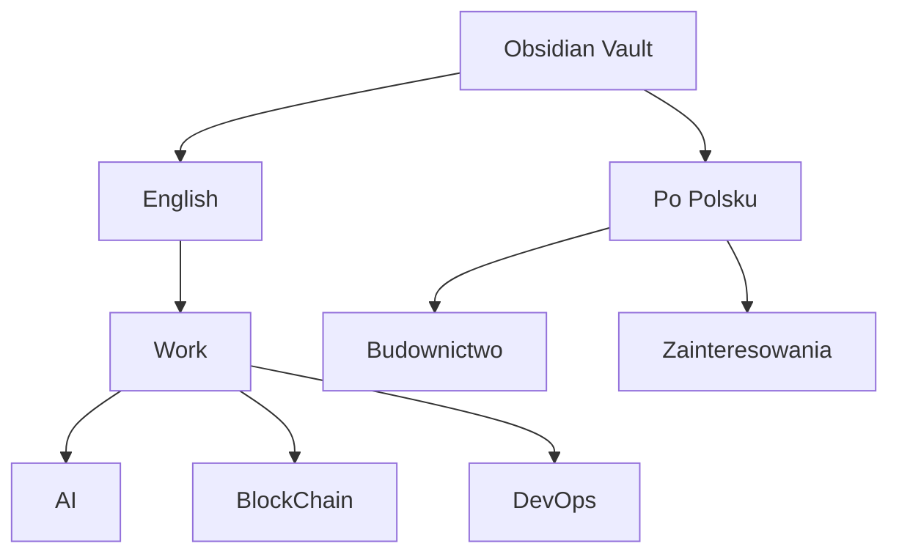

# Obsidian Knowledge Base

```mermaid
graph TD;
    A[Obsidian Vault] --> B[English]
    A --> C[Po Polsku]
    
    B --> G[Work]
    
    G --> D[AI]
    G --> E[BlockChain]
    G --> F[DevOps]

    C --> H[Budownictwo]
    C --> I[Zainteresowania]
```
